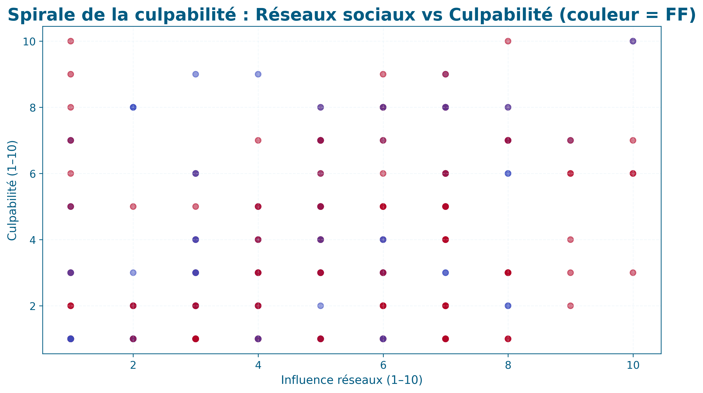
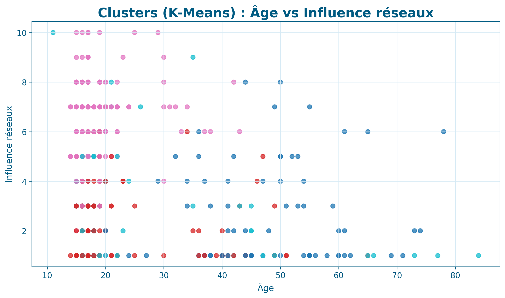

# FashionBehaviorAnalysis
## Quand le bleu céruléen devient une donnée

---

## Contexte

Ce projet est inspiré du célèbre monologue du *bleu céruléen* dans **Le Diable s’habille en Prada**, qui illustre comment les tendances de la mode — souvent perçues comme des choix personnels — sont en réalité façonnées par une industrie complexe.

L’objectif est d’explorer une question centrale :

**Comment l’industrie de la mode influence-t-elle les comportements et les décisions individuelles dans notre société ?**

À partir d’une enquête quantitative menée auprès de 428 répondants, ce projet combine data science, sociologie de la mode et storytelling visuel pour analyser les paradoxes entre discours éthique, pression sociale et pratiques réelles.

---

## Problématique

Comment l’industrie de la mode impacte-t-elle le comportement et les choix vestimentaires ?

Plus précisément :
- Existe-t-il un décalage entre valeurs déclarées et comportements réels ?
- Quel rôle jouent les réseaux sociaux et les tendances ?
- Peut-on identifier des profils psychologiques de consommateurs ?

---

## Structure du projet

FashionBehaviorAnalysis/
│
├── data/
│   └── La mode - LaMode.csv
│
├── notebooks/
│   └── notebook_visualisations.py
│
├── reports/
│   ├── figures/
│   ├── personas_clusters.csv
│   ├── personas_moyennes_par_cluster.csv
│   └── kmeans_elbow_silhouette.csv
│
├── requirements.txt
└── README.md

---

## Installation

### Cloner le projet

git clone https://github.com/melissa-mariano/FashionBehaviorAnalysis.git
cd FashionBehaviorAnalysis

### Créer un environnement virtuel (recommandé)

python -m venv venv
venv\Scripts\Activate.ps1

### Installer les dépendances

pip install -r requirements.txt

---

## Utilisation

python notebooks/notebook_visualisations.py

Ce script :
- nettoie et standardise les données de l’enquête
- génère l’ensemble des visualisations
- segmente les répondants en personas via clustering
- exporte les résultats dans le dossier reports/

---

## Visualisations principales

Parce que la mode n’est pas seulement esthétique, mais aussi décisionnelle, cette galerie visuelle présente les principales dynamiques observées dans les données.  
Chaque visualisation contribue à raconter une histoire : celle des contradictions, des influences sociales et des choix individuels face à l’industrie de la mode.

---

### Le Grand Paradoxe : éthique vs comportement réel

Malgré une conscience éthique élevée, les comportements d’achat restent souvent guidés par l’émotion, les tendances et la pression sociale.  
Ce graphique met en lumière le décalage entre intentions déclarées et pratiques observées.

---

### Influence des réseaux sociaux et spirale de culpabilité

L’exposition constante aux tendances crée une dynamique cyclique : désir, achat, culpabilité, puis retour à la consommation.  
Une lecture essentielle pour comprendre les mécanismes psychologiques derrière la mode rapide.

---

### Personas et segmentation comportementale

Le clustering révèle plusieurs profils distincts de consommateurs.  
Chaque persona incarne une relation différente à la mode : rationnelle, impulsive, engagée ou influencée.

---

### Cartographie des renoncements par cluster

Certains groupes expriment une volonté de consommer mieux, mais renoncent différemment selon leur rapport au prix, à l’image sociale ou à l’impact environnemental.

---

### Obsolescence psychologique selon les profils

La perception de l’obsolescence n’est pas seulement liée au produit, mais aussi à la pression symbolique des tendances.

---

### Réseau des items et tendances dominantes

Une visualisation relationnelle qui montre comment certains thèmes se renforcent mutuellement dans l’imaginaire collectif.

---

### Heatmap des comportements par cluster

Cette heatmap synthétise les différences clés entre groupes, révélant des patterns invisibles dans une lecture linéaire des données.

---

### Arbre de décision — Acceptation de payer plus

Un modèle explicatif qui illustre les variables les plus influentes dans la disposition à payer davantage pour une mode plus responsable.

---

### Fin de vie des produits et fréquence d’achat

Une perspective concrète sur le cycle réel des vêtements : conservation, revente, don ou abandon.

---

### Lecture finale

Entre aspiration éthique et plaisir esthétique, la mode apparaît comme un espace de tension permanente.  
Ces visualisations proposent une approche analytique — mais assumée, sensible et contemporaine — de ce que signifie consommer la mode aujourd’hui.

---

## Méthodologie

- Nettoyage et normalisation des données
- Transformation des échelles de type Likert
- Feature engineering sociologique
- Clustering K-Means
- Arbre de décision
- Visualisations narratives

---

## Objectifs du projet

- Comprendre les dynamiques sociales derrière les choix vestimentaires
- Mettre en évidence l’influence structurelle de l’industrie de la mode
- Transformer un phénomène culturel en analyse data-driven
- Construire un storytelling visuel basé sur des données réelles

---

## Dépendances principales

- pandas
- numpy
- matplotlib
- plotly
- scikit-learn

---

## Auteur

Melissa Albuquerque
