# Le céruléen n’est jamais “juste du bleu” : comment l’industrie de la mode façonne nos choix et notre rapport à nous-mêmes

Explorer la mode comme un système de données : comportements d’achat, tensions éthiques, pression sociale et segmentation des profils consommateurs.

---

## Contexte

Ce projet est inspiré du célèbre monologue du *bleu céruléen* dans **Le Diable s’habille en Prada**, qui illustre comment les tendances — souvent perçues comme des choix individuels — sont en réalité façonnées par un système industriel structuré.

À partir d’une enquête quantitative menée auprès de **428 répondants**, le pipeline propose une analyse orientée **data storytelling**, traduisant des comportements sociaux (achat, influence, culpabilité, arbitrages, fin de vie) en structures analytiques lisibles à l’aide de visualisations avancées et d’exports automatisés.

---

## Problématique

Comment l’industrie de la mode impacte-t-elle le comportement et les choix vestimentaires ?

Questions principales :
- Existe-t-il un décalage entre valeurs déclarées et comportements réels ?
- Quel rôle jouent les réseaux sociaux, la tendance et la pression sociale ?
- Peut-on identifier des profils (personas) via une segmentation exploratoire ?
- Quels arbitrages structurent les décisions (prix, qualité, confort, éthique, tendance) ?
- Comment la fréquence d’achat est-elle liée à la fin de vie des vêtements ?

---

## Structure du projet

```
FashionBehaviorAnalysis/
│
├── data/
│   └── La mode - LaMode.csv
│
├── notebooks/
│   └── pipeline_visualisations.py
│
├── reports/
│
├── requirements.txt
└── README.md
```

---

## Installation

### Cloner le projet

git clone https://github.com/melissa-mariano/FashionBehaviorAnalysis.git  
cd FashionBehaviorAnalysis

### Créer un environnement virtuel (recommandé)

Windows (PowerShell) :
python -m venv venv  
venv\Scripts\Activate.ps1

macOS / Linux :
python3 -m venv venv  
source venv/bin/activate

### Installer les dépendances

pip install -r requirements.txt

---

## Utilisation

python notebooks/pipeline_visualisations.py

Ce script exécute un **pipeline analytique complet** :

- normalisation robuste des échelles Likert (détection automatique)
- design system visuel inspiré du bleu céruléen
- construction d’indicateurs sociologiques (paradoxe éthique, obsolescence psychologique)
- visualisations narratives (hexbin, Sankey, réseaux, heatmaps)
- clustering exploratoire K-Means + projection PCA
- arbre de décision interprétable 
- génération automatique des exports (figures, diagnostics, tableaux)

---

## Logique analytique (chapitres)

- Chapitre 1 — Discours vs réalité : le Grand Paradoxe  
  Analyse du décalage entre valeurs déclarées, culpabilité ressentie et comportements réels liés à la fast fashion.

- Chapitre 2 — Réseaux sociaux, influence et dynamiques de tendances  
  Exploration de l’influence perçue des réseaux sociaux, de leur lien avec les tendances et des corrélations psycho-sociales associées.

- Chapitre 3 — Machine à tendances : co-adoption et structures d’items  
  Identification des “packs” de tendances et des logiques d’adoption collective via réseaux d’items et heatmaps.

- Chapitre 4 — Personas et segmentation comportementale  
  Construction d’une typologie de consommateurs à partir du clustering K-means et projection PCA.

- Chapitre 5 — Uniformisation et pression sociale  
  Lecture des effets d’obsolescence psychologique, de pression sociale et d’homogénéisation des comportements.

- Chapitre 6 — Arbitrages structurés et renoncements  
  Analyse des compromis entre prix, éthique, confort et image sociale selon les clusters.

- Chapitre 7 — Décision explicable : payer plus pour l’éthique  
  Modélisation interprétable via arbre de décision pour comprendre les facteurs associés à la disposition à payer davantage.

- Chapitre 8 — Conséquences comportementales : fréquence d’achat et fin de vie  
  Mise en relation du rythme d’achat avec les pratiques de fin de vie des vêtements et les logiques de circularité.

---

## Galerie des visualisations

> **Note :** toutes les images sont stockées dans `reports/figures/`.  
> Les visualisations **Sankey** sont interactives (`.html`) et accessibles via lien.

---

### 1) Parcours & structure des comportements

#### 1.1 Sankey — parcours (3 étapes)
**Objectif :** visualiser les enchaînements dominants entre fréquence d’achat, canal et fast fashion.  
**Lecture :** l’épaisseur des flux indique la fréquence des parcours observés.  
👉 Ouvrir la visualisation : https://melissa-mariano.github.io/FashionBehaviorAnalysis/reports/sankey_parcours_3_etapes.html

#### 1.2 Sankey — cycle complet (4 étapes)
**Objectif :** représenter le cycle complet incluant la destination de fin de vie.  
**Lecture :** met en évidence les trajectoires majoritaires et marginales.  
👉 Ouvrir la visualisation : https://melissa-mariano.github.io/FashionBehaviorAnalysis/reports/sankey_cycle_complet_4_etapes.html

---

### 2) Segmentation (K-means) & personas

#### 2.1 Typologie des consommateurs (waffle chart)
**Objectif :** visualiser le poids relatif de chaque cluster dans l’échantillon.  
**Lecture :** 1 carré ≈ 1 répondant.  
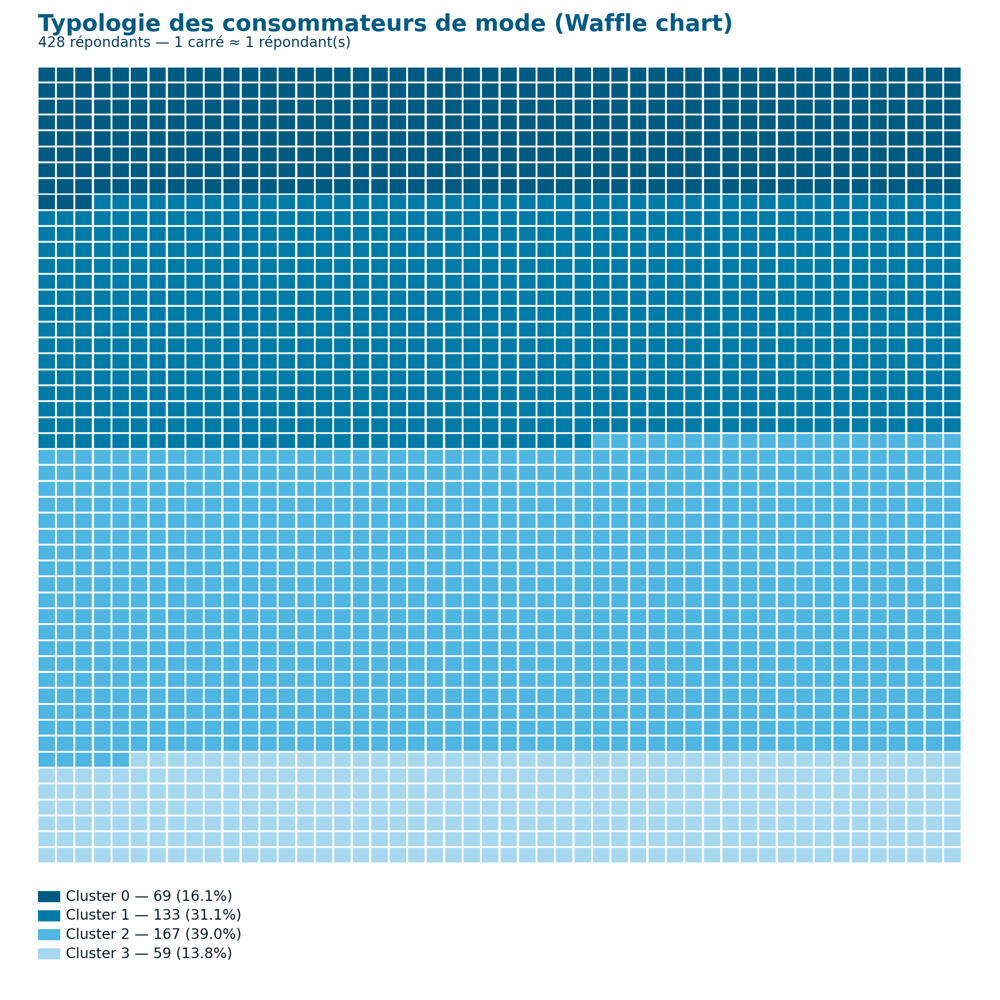

#### 2.2 Projection des personas (PCA 2D)
**Objectif :** observer la séparation (ou le recouvrement) des clusters dans un espace réduit.  
**Lecture :** des groupes bien distincts suggèrent une segmentation robuste.  
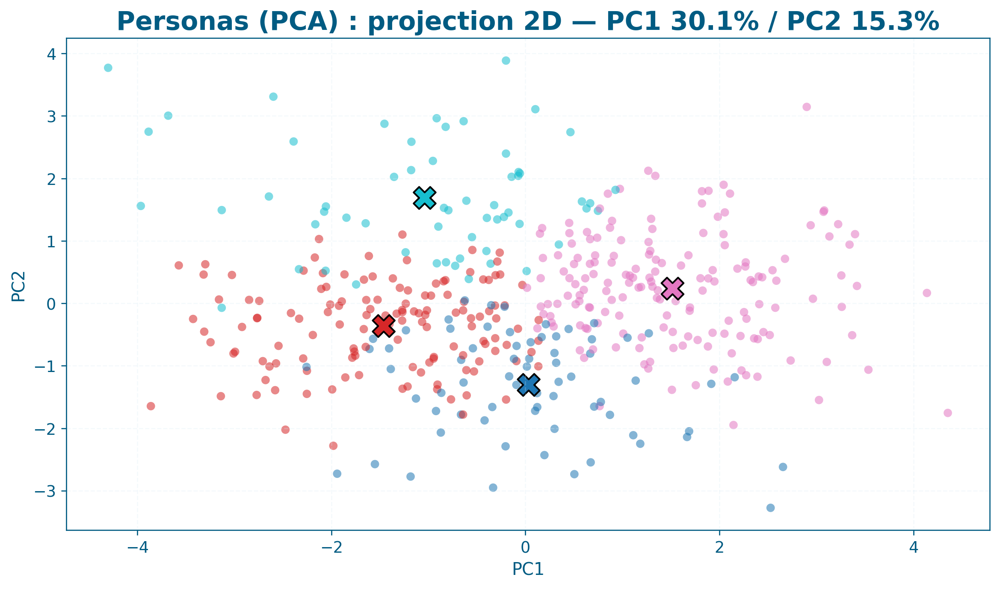

#### 2.3 Heatmap — items par cluster
**Objectif :** comparer les clusters sur l’adoption d’items et variables clés.  
**Lecture :** intensité de couleur = niveau moyen ou taux d’adoption.  
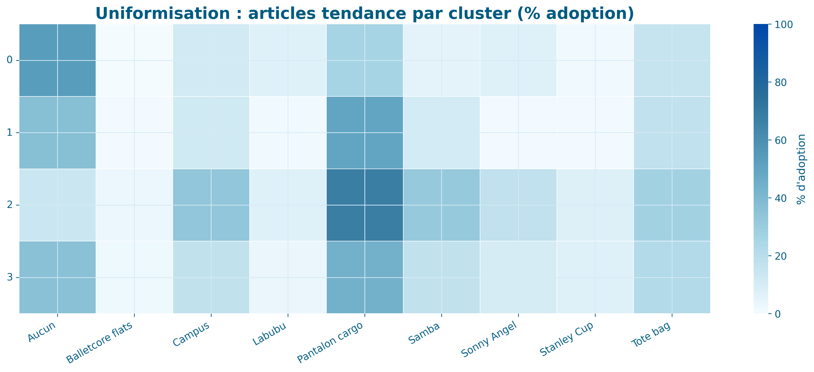

---

### 3) Réseaux sociaux & tendances

#### 3.1 Réseaux sociaux vs tendances — densité des réponses
**Objectif :** analyser la relation entre l’influence perçue des réseaux sociaux et celle des tendances.  
**Lecture :** les zones les plus foncées correspondent aux combinaisons de réponses les plus fréquentes.  
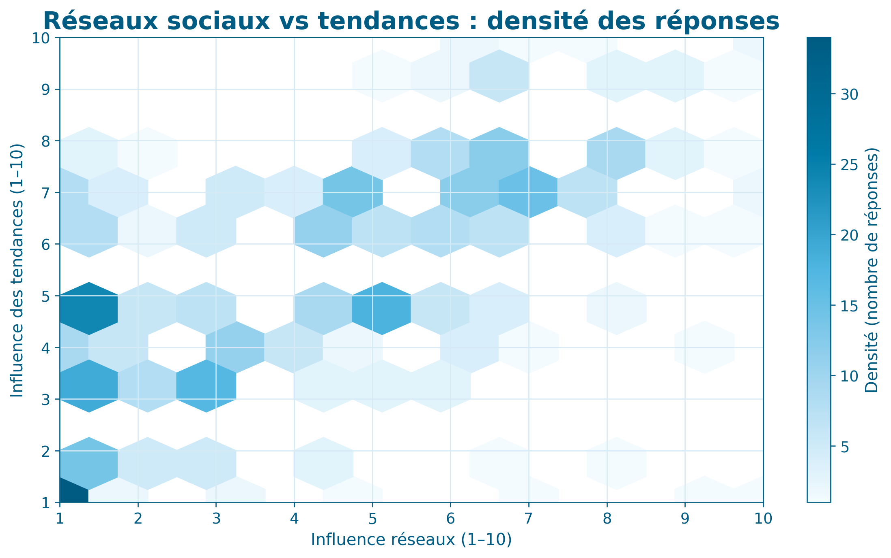

#### 3.2 Distribution — influence des réseaux sociaux
**Objectif :** décrire la répartition des scores d’influence des réseaux (1–10).  
**Lecture :** permet d’identifier le niveau d’exposition dominant.  
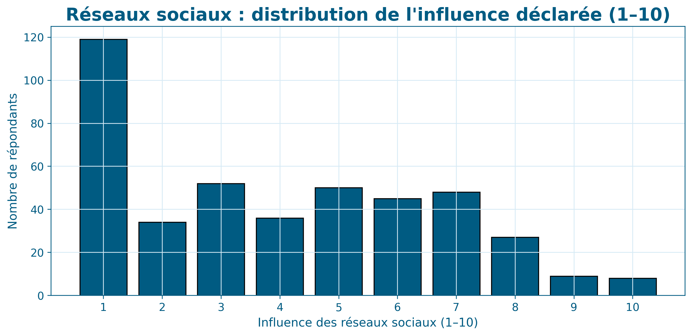

#### 3.3 Fast fashion selon l’influence des réseaux
**Objectif :** tester l’association entre influence des réseaux et consommation de fast fashion.  
**Lecture :** comparaison des pratiques selon le niveau d’influence.  
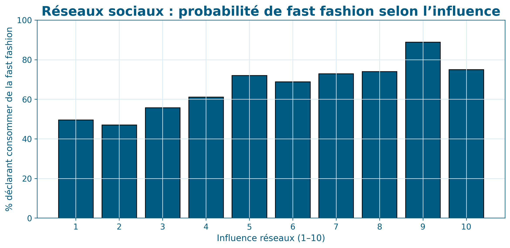

#### 3.4 Heatmap — corrélations (réseaux, tendances, fast fashion)
**Objectif :** synthétiser les corrélations entre variables clés.  
**Lecture :** utile pour repérer des relations fortes à approfondir.  
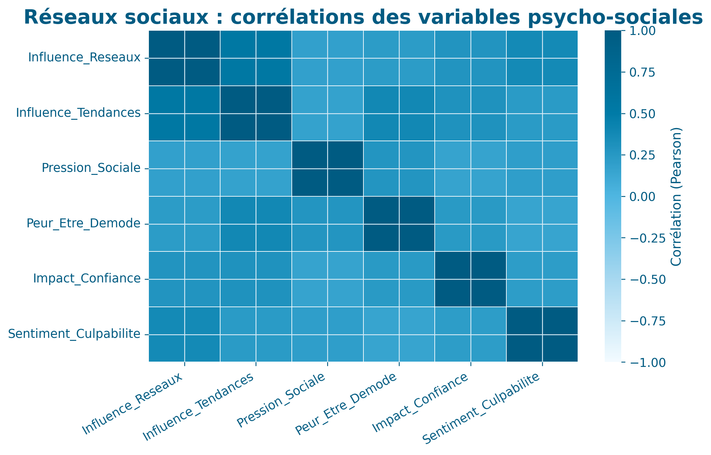

---

### 4) Culpabilité, éthique & paradoxe

#### 4.1 Densité — éthique vs culpabilité
**Objectif :** visualiser la distribution conjointe de la sensibilité éthique et de la culpabilité.  
**Lecture :** les zones denses indiquent les profils majoritaires.  
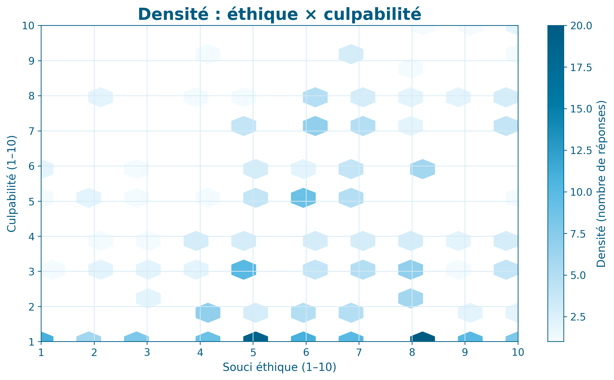

#### 4.2 Boxplot — culpabilité par paradoxe
**Objectif :** comparer la culpabilité selon la présence d’un paradoxe valeurs/comportements.  
**Lecture :** médiane et dispersion par groupe.  
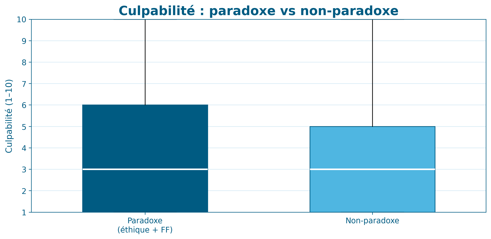

#### 4.3 Le « grand paradoxe »
**Objectif :** illustrer la coexistence entre conscience éthique élevée et pratiques contradictoires.  
**Lecture :** visuel de synthèse du décalage valeurs / actions.  
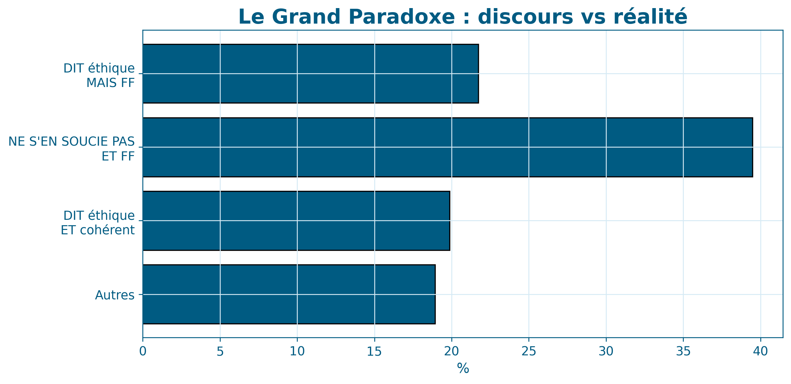

#### 4.4 Paradoxe par âge
**Objectif :** analyser les variations générationnelles du paradoxe.  
**Lecture :** comparaison par tranches d’âge.  
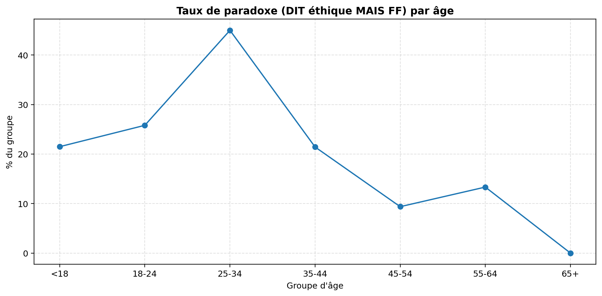

#### 4.5 Paradoxe par canal d’achat
**Objectif :** examiner le rôle du canal d’achat dans l’expression du paradoxe.  
**Lecture :** mise en relation des pratiques et du contexte d’achat.  
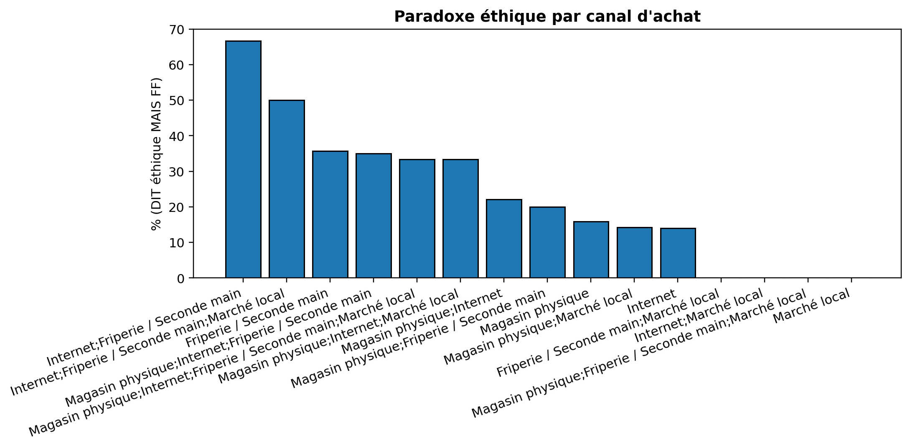

---

### 5) Obsolescence psychologique & fast fashion

#### 5.1 Obsolescence psychologique par cluster
**Objectif :** mesurer la sensibilité au « démodé » selon les profils.  
**Lecture :** identification des clusters les plus exposés à la pression symbolique.  
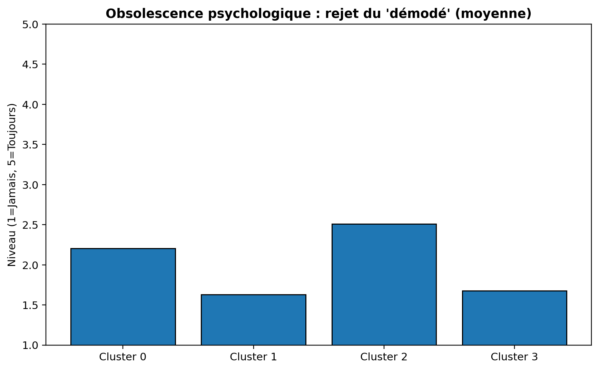

#### 5.2 Fast fashion — part par cluster
**Objectif :** comparer la consommation de fast fashion entre clusters.  
**Lecture :** repérage des segments les plus consommateurs.  
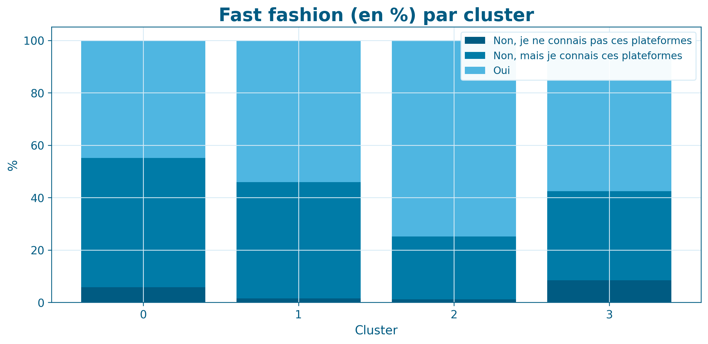

---

### 6) Fréquence d’achat & fin de vie

#### 6.1 Distribution — fréquence d’achat
**Objectif :** décrire le rythme d’achat des répondants.  
**Lecture :** distinction entre acheteurs occasionnels et fréquents.  
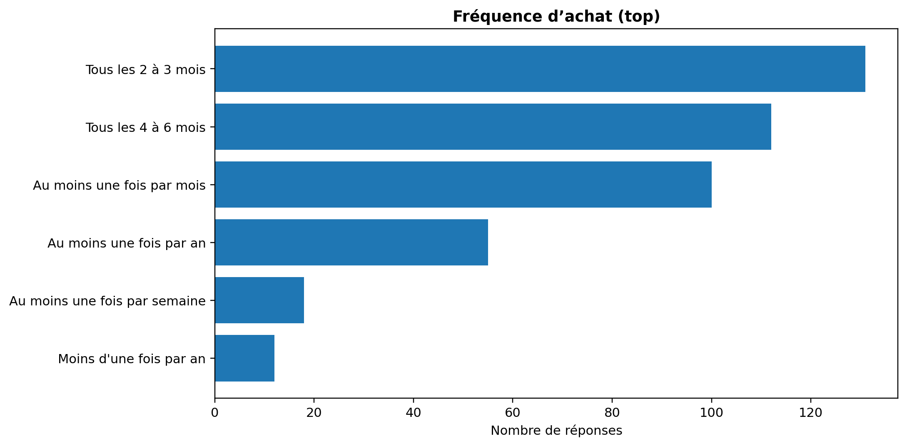

#### 6.2 Distribution — destination de fin de vie
**Objectif :** analyser les pratiques de fin de vie des vêtements.  
**Lecture :** don, revente, recyclage, stockage, jet.  
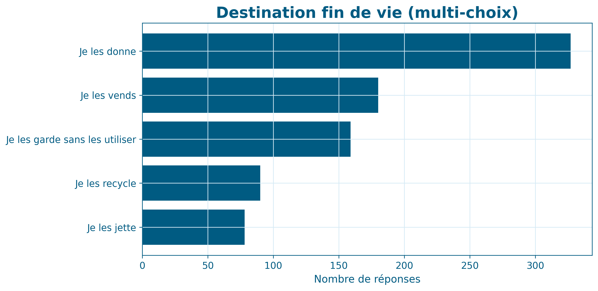

#### 6.3 Fin de vie selon la fréquence d’achat
**Objectif :** relier intensité d’achat et comportements de fin de vie.  
**Lecture :** met en évidence des logiques de renoncement ou d’accumulation.  
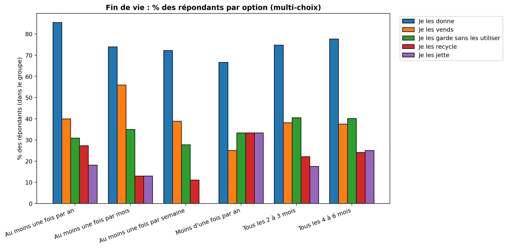

---

### 7) Canaux d’achat

#### 7.1 Distribution — canaux d’achat
**Objectif :** identifier les canaux dominants de consommation.  
**Lecture :** contextualise les comportements observés.  
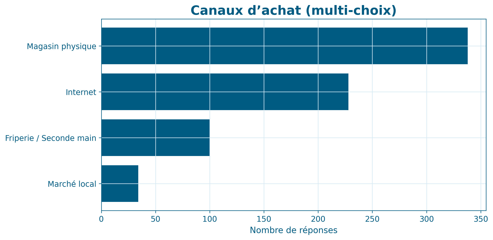

---

### 8) Renoncements & arbitrages

#### 8.1 Carte — renoncements par cluster
**Objectif :** montrer les arbitrages et renoncements selon les segments.  
**Lecture :** met en évidence les clusters les plus enclins au changement.  
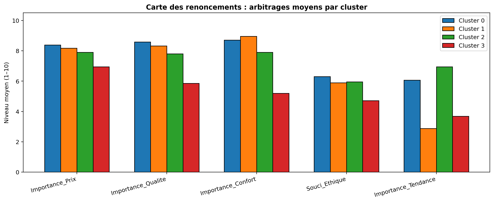

---

### 9) Modélisation explicative

#### 9.1 Arbre de décision — payer plus (produit éthique)

**Objectif :** identifier les facteurs et seuils associés à la probabilité de payer environ +20 % pour un produit perçu comme éthique.

**Lecture :**  
- Chaque nœud correspond à une règle (seuil sur une variable).  
- Les branches indiquent les combinaisons de conditions menant à une décision.  
- Les nœuds terminaux (dernière ligne) représentent des **décisions finales** (*Paie* / *Ne paie pas*).  
- L’absence de critère dans ces nœuds signifie que, compte tenu des conditions précédentes, aucune séparation supplémentaire n’améliore la prédiction : la décision est considérée comme stable.

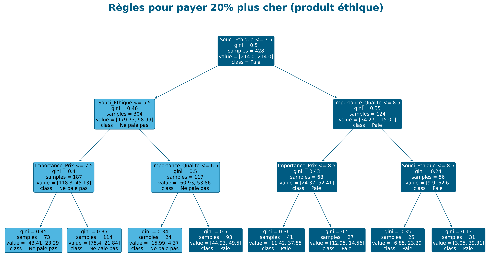

---

## Méthodologie

- Nettoyage et normalisation des données (formats FR, Likert)
- Renommage robuste et détection automatique des variables
- Feature engineering sociologique
- Analyse de densité (hexbin)
- Clustering K-Means + PCA
- Réseaux de corrélation (packs de tendances)
- Arbre de décision interprétable
- Data storytelling visuel

---

## Objectifs du projet

- Comprendre les dynamiques sociales derrière les choix vestimentaires
- Mettre en évidence l’influence structurelle de l’industrie de la mode
- Transformer un phénomène culturel en analyse data-driven

---

## Dépendances principales

- pandas
- numpy
- matplotlib
- seaborn
- plotly
- scikit-learn

---

## Auteur

Melissa Albuquerque
